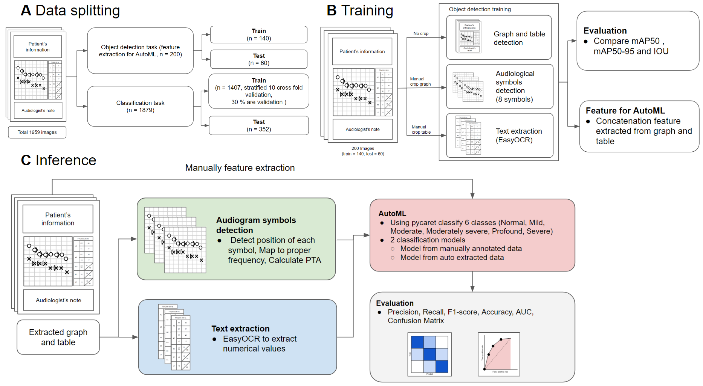
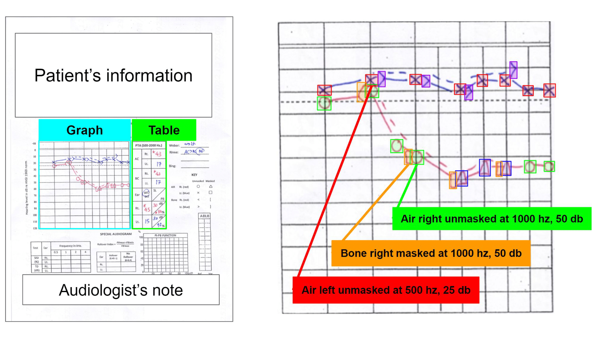
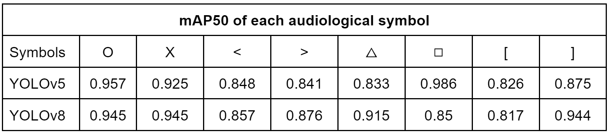
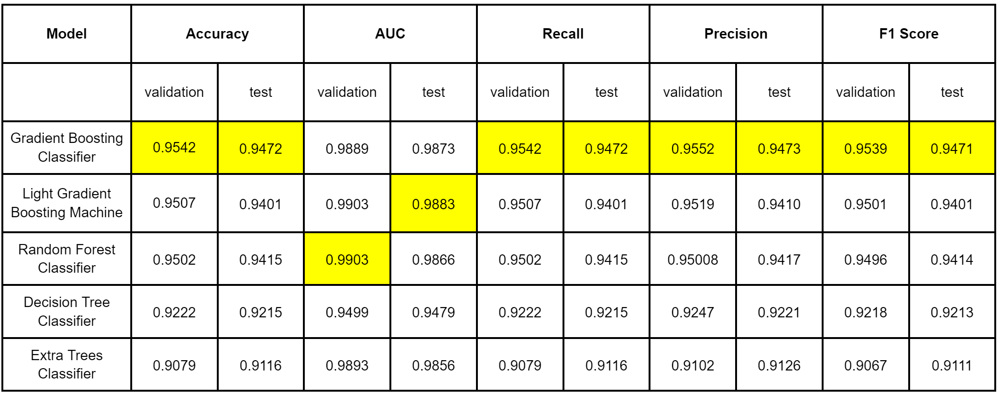
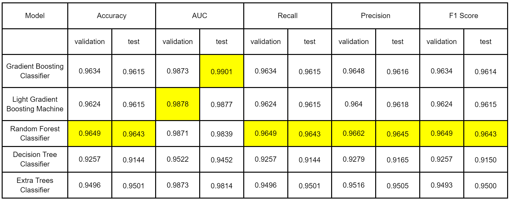

# Autoaudiogram: Object detection-based audiogram classification.

AutoAudiogram is an object detection-based audiogram classification system. The model uses object detection to detect the audiological symbols
from the audiogram and then use them to classify the degree of hearing loss severity.



For the data collection, we annotation 200 audiograms including graphs, tables, and 8 audiological symbols.



## Get Started

Clone the repository and navigate into the project directory

```sh
git clone https://github.com/biodatlab/autoaudiogram.git
cd autoaudiogram
```

## Graph and table training

Navigate to the directory `cd src/data_extracter/graph_table` and organize the folder in this directory as follows

```
graph_table
|____data
| |____images
| |____labels
|____runs
|____config.yaml
|____eval.ipynb
|____train.ipynb
|____train.py
```

Then run `train.py` using

```sh
python -m train
```

## Audiological symbol training

Navigate to the directory `cd src/data_extracter/symbol_detection` and organize the folder as follows

```
symbol_detection
|____data
| |____images
| |____labels
|____runs
|____config.yaml
|____eval.ipynb
|____train.ipynb
|____train.py
```

Then run `train.py` using

```
python -m train
```

## Severity classification

Navigate to the directory `cd src/classification` and organize folder as follows

```
|classification
|____data
| |____train_extract.csv # example file name
| |____test_extract.csv
| |____train_true.csv
| |____test_true.csv
|____evalute
| |____extract
| |____true
|____model
|____eval.ipynb
|____train.ipynb
```

```
python -m train --path <path to train file> # python -m train --path "data/data_extract.csv"
```

# Evaluation

## Object Detection

Summary of object detection evaluation 

mAP score of each symbol 


## Hearing severity classification

Summary of model train from automatic extraction



Summary of model train from maunal extraction 




